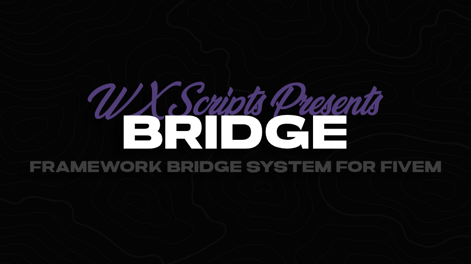

# About

WX Bridge is an advanced system for FiveM that allows you to bridge multiple frameworks. With WX Bridge, you don't have to write your own support for multiple framework-dependent functions, such as retrieving a player's job. You can use snippets from this system or add the entire system as a dependency, and then use it with exports.

# Usage
* Choose your framework in `configs/bridge_config.lua`

```lua
-- client.lua
local PlayerData = exports.wx_bridge:GetPlayerData()
print(json.encode(PlayerData, {
    indent = true
}))
```
# Available Exports:
### Client


| Function                                          | Description                                                                   | Parameters                               | Return Type       |
|---------------------------------------------------|-------------------------------------------------------------------------------|------------------------------------------|-------------------|
| `exports.wx_bridge:GetPlayerData()`               | Returns current player's data, like character info (name, job, etc.).         | None                                     | table             |
| `exports.wx_bridge:IsPlayerLoaded()`              | Returns `true` if the player has chosen their character.                       | None                                     | boolean           |
| `exports.wx_bridge:SetPlayerData(key, value)`     | Modifies the current player's data.                                           | `key` (string), `value` (any)           | None              |
| `exports.wx_bridge:OpenInventory()`               | Opens the inventory through the framework.                                     | None                                     | None              |
| `exports.wx_bridge:ShowNotification(text)`        | Shows a notification through the framework.                                    | `text` (string)                          | None              |

### Server

### Available Functions

### Client

| Function                                          | Description                                                                   | Parameters                               | Return Type       |
|---------------------------------------------------|-------------------------------------------------------------------------------|------------------------------------------|-------------------|
| `exports.wx_bridge:GetPlayerData()`               | Returns current player's data, like character info (name, job, etc.).         | None                                     | table             |
| `exports.wx_bridge:IsPlayerLoaded()`              | Returns `true` if the player has chosen their character.                      | None                                     | boolean           |
| `exports.wx_bridge:SetPlayerData(key, value)`     | Modifies the current player's data.                                           | `key` (string), `value` (any)            | None              |
| `exports.wx_bridge:OpenInventory()`               | Opens the inventory through the framework.                                    | None                                     | None              |
| `exports.wx_bridge:ShowNotification(text)`        | Shows a notification through the framework.                                   | `text` (string)                          | None              |
| `exports.wx_bridge:Dispatch(code, title, message, blip, jobs, important)` | Client side function for police dispatch | `code` (string), `title` (string), `message` (string), `blip` (number), `jobs` (table), `important` (boolean \| number) | None |
| `exports.wx_bridge:GetJob()` | Returns player's job name | None | string |
| `exports.wx_bridge:GetJobGrade()` | Returns player's job grade number | None | number |
| `exports.wx_bridge:HasItem(item_name)` | Returns boolean - Checks if player has given item in inventory | `item_name` (string) | boolean |
| `exports.wx_bridge:GetInventory()` | Returns player's inventory contents | None | table |


# TODO
* More frameworks ([ND_Core](https://github.com/ND-Framework/ND_Core), [ox_core](https://github.com/overextended/ox_core))
* More functions for QB Core

## Contributing
Contributions are welcome! If you have any suggestions or improvements, please submit a pull request or open an issue.

## License
WX Bridge is licensed under the MIT License. See the LICENSE file for more details.

## Support
If you encounter any issues, feel free to open an issue. Do not open issues with questions on how to use this.

